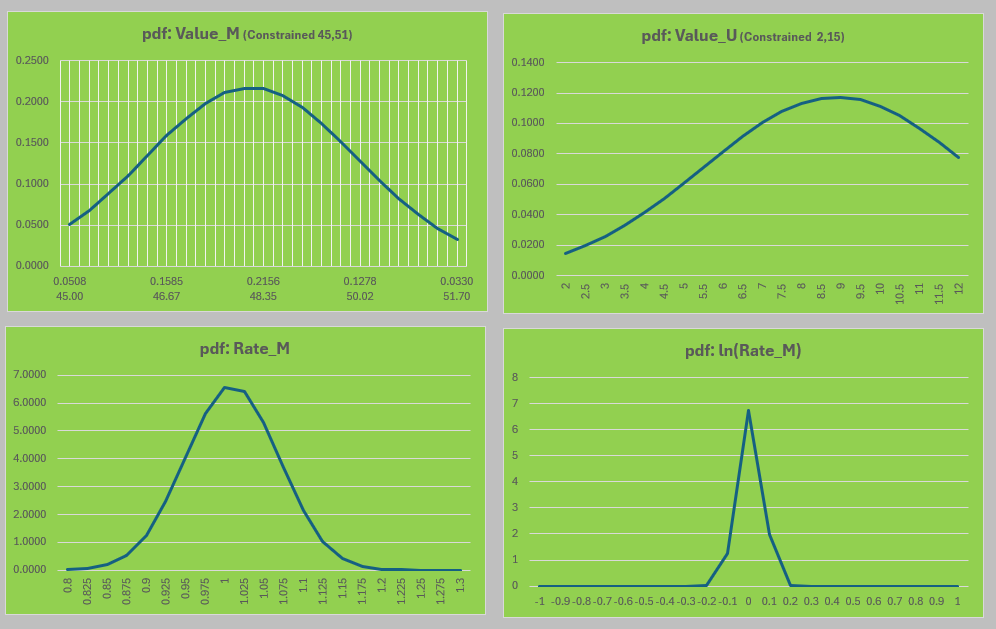

# Gender Variable Validation — Rate Method Proposal

Statistical validation of gender distribution across enrollment years. Includes a proposed shift from arithmetic to geometric mean for year-over-year rate comparisons, with value-level z-score flagging, delta review, rate analysis, and log-normal probability densities.

---

## Methodology: Proposed Rate Review (YoY Comparisons)

Rates of change are multiplicative. The geometric mean is more appropriate than the arithmetic mean for ratio-scale measurements — it treats a 0.5x change (halving) symmetrically with a 2x change (doubling).

**Formulas:**

```
m₁₀ = (1/9) × Σ ln(rᵢ)   for i = 1 to 9     [mean of ln rates]
s₁₀ = sd(ln rᵢ)                               [std dev of ln rates]
z₁₀ = (x₁₀ - m₁₀) / s₁₀                      [z-score of 2024 ln rate]
```

**Comparative Example:**

```
count_series = {1, 2, 1}
rate_1 = 2
rate_2 = 0.5

Arithmetic Mean of rates = 1.25
Geometric Mean of rates  = 1.00
```

Given that the count series returned to its initial state of 1, the geometric mean of 1 more accurately reflects no net change — supporting its use over the arithmetic mean for evaluating rate-based volatility.

**Notes:**
1. Rates of change are multiplicative.
2. The geometric mean is the nth root of the product of n numbers.
3. The logarithmic scale reduces the effect of large numbers on central tendency.
4. Using the geometric mean of ln(rates) treats 0.5x and 2x symmetrically, with a net effect of 1.

---

---

## Original Validation of Values

| Variable | Value | 2014 | 2015 | 2016 | 2017 | 2018 | 2019 | 2020 | 2021 | 2022 | 2023 | 2024 | Min | Mean | Max | StDev | Z (2024) | Flag |
|----------|-------|------|------|------|------|------|------|------|------|------|------|------|-----|------|-----|-------|----------|------|
| GENDER | M | 46 | 45 | 51 | 49 | 47 | 50 | 48 | 50 | 47 | 49 | 56 | 45 | 48 | 51 | 1.84 | 4.282 | ✅ |
| GENDER | F | 52 | 52 | 52 | 53 | 51 | 53 | 53 | 53 | 54 | 52 | 51 | 51 | 52 | 54 | 0.86 | -1.629 | |
| GENDER | U | 6 | 5 | 10 | 13 | 11 | 12 | 8 | 10 | 3 | 11 | 25 | 3 | 9 | 13 | 3.40 | 4.739 | ✅ |

Flag = z_2024 > 2.5

---

## Review of Deltas

| Variable | Value | 2015 | 2016 | 2017 | 2018 | 2019 | 2020 | 2021 | 2022 | 2023 | 2024 | Min | Mean | Max | StDev | Z Delta | Flag |
|----------|-------|------|------|------|------|------|------|------|------|------|------|-----|------|-----|-------|---------|------|
| GENDER | M | 0 | 5 | -2 | -2 | 3 | -2 | 2 | -3 | 2 | 7 | -3 | 0 | 5 | 2.83 | 2.261 | |
| GENDER | F | 0 | 0 | 1 | -2 | 1 | 1 | -1 | 1 | -2 | -1 | -2 | 0 | 1 | 1.28 | -0.606 | |
| GENDER | U | -2 | 5 | 3 | -3 | 2 | -5 | 2 | -7 | 8 | 14 | -7 | 1 | 8 | 4.89 | 2.778 | ✅ |

Flag = z_delta > 2.5

---

## Review of Rates

`meanLN` and `stdevLN` computed using SUMPRODUCT with natural log functions.

| Variable | Value | 2015 | 2016 | 2017 | 2018 | 2019 | 2020 | 2021 | 2022 | 2023 | 2024 | Min | Mean | MeanLN | Max | StDev | StDevLN | Z (lnRate) | Flag |
|----------|-------|------|------|------|------|------|------|------|------|------|------|-----|------|--------|-----|-------|---------|------------|------|
| GENDER | M | 1.0 | 1.1 | 1.0 | 1.0 | 1.1 | 1.0 | 1.0 | 0.9 | 1.1 | 1.1 | 0.9 | 1.00957 | 0.00798 | 1.1 | 0.06006 | 0.05869 | 2.064 | |
| GENDER | F | 1.0 | 1.0 | 1.0 | 1.0 | 1.0 | 1.0 | 1.0 | 1.0 | 1.0 | 1.0 | 1.0 | 1.00071 | 0.00044 | 1.0 | 0.02424 | 0.02438 | -0.621 | |
| GENDER | U | 0.8 | 2.1 | 1.3 | 0.8 | 1.2 | 0.6 | 1.2 | 0.3 | 4.0 | 2.3 | 0.3 | 1.36671 | 0.06094 | 4.0 | 1.11107 | 0.75421 | 1.019 | |

Flag = z_lnRate > 2.5

---

## Review of ln(Rates)

| Variable | Value | 2015 | 2016 | 2017 | 2018 | 2019 | 2020 | 2021 | 2022 | 2023 | 2024 | MinLN | MeanLN | MaxLN | StDevLN | Z (lnRate) | Match |
|----------|-------|------|------|------|------|------|------|------|------|------|------|-------|--------|-------|---------|------------|-------|
| GENDER | M | -0.0097 | 0.1124 | -0.0399 | -0.0373 | 0.0610 | -0.0373 | 0.0309 | -0.0604 | 0.0521 | 0.1 | -0.1 | 0.00798 | 0.1 | 0.05869 | 2.064 | MATCH |
| GENDER | F | 0.0 | 0.0 | 0.0 | 0.0 | 0.0 | 0.0 | 0.0 | 0.0 | 0.0 | 0.0 | 0.0 | 0.00044 | 0.0 | 0.02438 | -0.621 | MATCH |
| GENDER | U | -0.3 | 0.8 | 0.3 | -0.2 | 0.2 | -0.5 | 0.2 | -1.3 | 1.4 | 0.8 | -1.3 | 0.06094 | 1.4 | 0.75421 | 1.019 | MATCH |

---

## Probability Density Intervals

Intervals and data used to construct probability density functions for value and rate distributions.

| Interval | Value M | PDF (M) | Value U | PDF (U) | Rate M | PDF Rate (M) | ln(Rate) M | PDF ln(Rate) M |
|----------|---------|---------|---------|---------|--------|--------------|------------|----------------|
| 1 | 45.00 | 0.0508 | 2.0 | 0.0149 | 0.800 | 0.0151 | -1.0 | 5.99E-64 |
| 2 | 45.33 | 0.0679 | 2.5 | 0.0199 | 0.825 | 0.0591 | -0.9 | 7.19E-52 |
| 3 | 45.67 | 0.0885 | 3.0 | 0.0260 | 0.850 | 0.1947 | -0.8 | 4.73E-41 |
| 4 | 46.00 | 0.1110 | 3.5 | 0.0332 | 0.875 | 0.5396 | -0.7 | 1.71E-31 |
| 5 | 46.34 | 0.1349 | 4.0 | 0.0415 | 0.900 | 1.2576 | -0.6 | 3.38E-23 |
| 6 | 46.67 | 0.1585 | 4.5 | 0.0508 | 0.925 | 2.4646 | -0.5 | 3.66E-16 |
| 7 | 47.01 | 0.1801 | 5.0 | 0.0608 | 0.950 | 4.0617 | -0.4 | 2.18E-10 |
| 8 | 47.34 | 0.1980 | 5.5 | 0.0712 | 0.975 | 5.6286 | -0.3 | 7.12E-06 |
| 9 | 47.68 | 0.2106 | 6.0 | 0.0816 | 1.000 | 6.5590 | -0.2 | 0.012744 |
| 10 | 48.01 | 0.2167 | 6.5 | 0.0915 | 1.025 | 6.4272 | -0.1 | 1.251049 |
| 11 | 48.35 | 0.2156 | 7.0 | 0.1004 | 1.050 | 5.2959 | 0.0 | 6.735074 |
| 12 | 48.68 | 0.2075 | 7.5 | 0.1079 | 1.075 | 3.6695 | 0.1 | 1.988457 |
| 13 | 49.02 | 0.1933 | 8.0 | 0.1134 | 1.100 | 2.1380 | 0.2 | 0.032196 |
| 14 | 49.35 | 0.1741 | 8.5 | 0.1166 | 1.125 | 1.0475 | 0.3 | 2.86E-05 |
| 15 | 49.69 | 0.1516 | 9.0 | 0.1174 | 1.150 | 0.4316 | 0.4 | 1.39E-09 |
| 16 | 50.02 | 0.1278 | 9.5 | 0.1156 | 1.175 | 0.1495 | 0.5 | 3.72E-15 |
| 17 | 50.36 | 0.1042 | 10.0 | 0.1114 | 1.200 | 0.0436 | 0.6 | 5.44E-22 |
| 18 | 50.69 | 0.0822 | 10.5 | 0.1051 | 1.225 | 0.0107 | 0.7 | 4.37E-30 |
| 19 | 51.03 | 0.0627 | 11.0 | 0.0970 | 1.250 | 0.0022 | 0.8 | 1.93E-39 |
| 20 | 51.36 | 0.0462 | 11.5 | 0.0876 | 1.275 | 0.0004 | 0.9 | 4.65E-50 |
| 21 | 51.70 | 0.0330 | 12.0 | 0.0774 | 1.300 | 0.0001 | 1.0 | 6.16E-62 |


